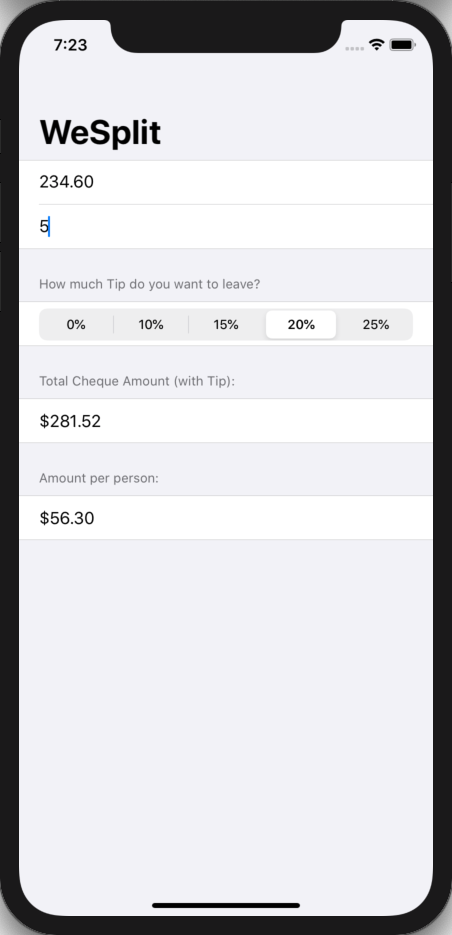

# 100 Days of SwiftUI Project 1

## WeSplit App

**App Description:**  Simple app to calculate the amount owed per person after a dinner, where a tip may be involved.

**Swift Features Used:**
View constructs such as NavigationView, Form, Section, TextField, Text. @State property wrapper, and binding with $.

**Screenshots:**

